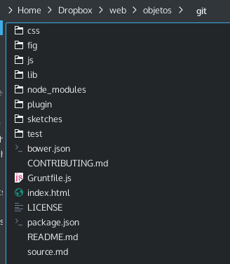
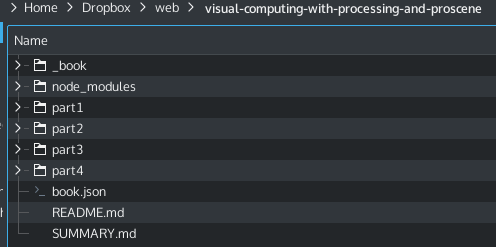
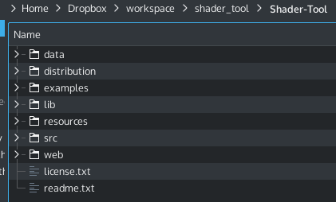

<section id="themes">
	<h2>Themes</h2>
		<p>
			Set your presentation theme: <br>
			<!-- Hacks to swap themes after the page has loaded. Not flexible and only intended for the reveal.js demo deck. -->
			<a href="#" onclick="document.getElementById('theme').setAttribute('href','css/theme/black.css'); return false;">Black (default)</a> -
			<a href="#" onclick="document.getElementById('theme').setAttribute('href','css/theme/white.css'); return false;">White</a> -
			<a href="#" onclick="document.getElementById('theme').setAttribute('href','css/theme/league.css'); return false;">League</a> -
			<a href="#" onclick="document.getElementById('theme').setAttribute('href','css/theme/sky.css'); return false;">Sky</a> -
			<a href="#" onclick="document.getElementById('theme').setAttribute('href','css/theme/beige.css'); return false;">Beige</a> -
			<a href="#" onclick="document.getElementById('theme').setAttribute('href','css/theme/simple.css'); return false;">Simple</a> <br>
			<a href="#" onclick="document.getElementById('theme').setAttribute('href','css/theme/serif.css'); return false;">Serif</a> -
			<a href="#" onclick="document.getElementById('theme').setAttribute('href','css/theme/night.css'); return false;">Night</a> -
			<a href="#" onclick="document.getElementById('theme').setAttribute('href','css/theme/moon.css'); return false;">Moon</a> -
			<a href="#" onclick="document.getElementById('theme').setAttribute('href','css/theme/solarized.css'); return false;">Solarized</a>
		</p>
</section>

H:

# Introduction to git

by some [National University of Colombia collaborators](https://github.com/orgs/objetos/people)

H:

# Index

 1. Introduction <!-- .element: class="fragment" data-fragment-index="1"-->
 2. Getting started <!-- .element: class="fragment" data-fragment-index="2"-->
 3. Git basics <!-- .element: class="fragment" data-fragment-index="3"-->
 3. Git branching <!-- .element: class="fragment" data-fragment-index="4"-->
 4. Distributed git  <!-- .element: class="fragment" data-fragment-index="5"-->
 5. References <!-- .element: class="fragment" data-fragment-index="6"-->
 6. Workshop <!-- .element: class="fragment" data-fragment-index="7"-->
 
H:

## Introduction

1. The problem
2. Version control system types
3. What's git?
4. Why use git?

V:

## Introduction
### The problem

working on a project comprising _several source files_

<figure>
    
    <figcaption>A presentation</figcaption>
</figure>

V:

## Introduction
### The problem

working on a project comprising _several source files_

<figure>
    
    <figcaption>A book</figcaption>
</figure>


V:

## Introduction
### The problem

working on a project comprising _several source files_

<figure>
    
    <figcaption>Any other software</figcaption>
</figure>

V:

## Introduction
### The problem

and wanna keep track of history

Why?

V:

## Introduction
### The problem

To time travel...

V:

## Introduction
### The problem

... in order to:

1. Go back in time and recover a previous state <!-- .element: class="fragment" data-fragment-index="1"-->
 * Undo a mistake
 * Explore history
 * Make edits starting there
2. Come back to the present <!-- .element: class="fragment" data-fragment-index="2"-->
 * _merge_ other history _branches_ 
 * (or do it the other way around)
 
V:

## Introduction
### The problem

Conclusion

'Creativity' (as when writting a book, coding a program) is:
 > a non-linear iterative process of experimentation towards *an open goal*<sup>*</sup>

<sup>*</sup> no matter how you do it, a goal that can anytime be _revised_ and/or broken up into _accomplishable stages_

V:

## Introduction
### Version control system types

<figure>
    
    <figcaption><a href="https://git-scm.com/book/en/v2/Getting-Started-About-Version-Control#Local-Version-Control-Systems">Local Version Control Systems</a></figcaption>
</figure>

V:

## Introduction
### Version control system types

<figure>
    
    <figcaption><a href="https://git-scm.com/book/en/v2/Getting-Started-About-Version-Control#Centralized-Version-Control-Systems">centralized Version Control Systems</a></figcaption>
</figure>

V:

## Introduction
### Version control system types

<figure>
    
    <figcaption><a href="https://git-scm.com/book/en/v2/Getting-Started-About-Version-Control#Distributed-Version-Control-Systems">Distributed Version Control Systems</a></figcaption>
</figure>


V:

## Introduction
### What is git

> Git is a [free and open source](https://git-scm.com/about/free-and-open-source) [distributed](https://en.wikipedia.org/wiki/Distributed_revision_control) [version control system](https://en.wikipedia.org/wiki/Revision_control) designed to handle everything from small to very large projects with speed and efficiency.

V:

## Introduction
### Why use git?

1. Private creativity affairs
2. Team creativity affairs

V:

## Introduction
### Why use git? Private creativity affairs

<li class="fragment">Whenever you wanna keep track of some project sources sequence of _main changes_
<li class="fragment">Whenever you wanna be creative an experiment some crazy idea without fearing
it should have been started in the past or of losing previous work

V:

## Introduction
### Why use git? Team creativity affairs

<figure>
    
    <figcaption><a href="https://git-scm.com/about/distributed">Subversion-Style Workflow</a></figcaption>
</figure>

V:

## Introduction
### Why use git? Team creativity affairs

<figure>
    
    <figcaption><a href="https://git-scm.com/about/distributed">Integration Manager Workflow</a></figcaption>
</figure>

V:

## Introduction
### Why use git?: Team creativity affairs

<figure>
    
    <figcaption><a href="https://git-scm.com/about/distributed">Dictator and Lieutenants Workflow</a></figcaption>
</figure>

V:Working with remotes

## Introduction
### Why use git?: Team creativity affairs

<figure>
    
    <figcaption><a href="https://help.github.com/articles/using-pull-requests/">Pull requests</a></figcaption>
</figure>

H:

## Getting started

1. Recorded history
2. File states
3. First time setup
4. Getting help

V:

## Getting started
### Recorded history

<figure>
    
    <figcaption><a href="https://git-scm.com/book/en/v2/Getting-Started-Git-Basics">Sequence of snapshots</a></figcaption>
</figure>

V:

## Getting started
### File states

A file may be in one out of three 'states':

<li class="fragment"> _Committed_ -> safely stored in your local database
<li class="fragment"> _Modified_ -> changed but not yet committed
<li class="fragment"> _Staged_ -> prepared to go into your next commit

V:

## Getting started
### File states

<figure>
    
    <figcaption><a href="https://git-scm.com/book/en/v2/Getting-Started-Git-Basics">Git project sections</a></figcaption>
</figure>

V:

## Getting started
### [first time setup](https://git-scm.com/book/en/v2/Getting-Started-First-Time-Git-Setup)

<li class="fragment"> User name and email:

```sh
$ git config --global user.name Falcao
$ git config --global user.email falcao@gmail.com
```

<li class="fragment"> much more like _editor_, _diff tool_, ...

<li class="fragment"> check it:

```sh
$ git config --list
```

V:

## Getting started
### Getting help

```sh
$ git help <command>
```

H:

## Git basics

1. Getting a repository
2. Recording changes
3. Viewing the commit history
4. Undoing things
5. Working with remotes

V:

## Git basics
### Getting a repository

<li class="fragment"> [Init](https://git-scm.com/book/en/v2/Git-Basics-Getting-a-Git-Repository#Initializing-a-Repository-in-an-Existing-Directory)
```sh
$ git init
```

<li class="fragment"> Add and commit some files
```sh
$ git add *.c
$ git add LICENSE
$ git commit -m 'initial project version'
```

V:

## Git basics
### Getting a repository

<li class="fragment"> [Cloning an existing repository](https://git-scm.com/book/en/v2/Git-Basics-Getting-a-Git-Repository#Cloning-an-Existing-Repository)
```sh
$ git clone https://github.com/objetos/git.git
```
<li class="fragment"> or using a different name:
```sh
$ git clone https://github.com/objetos/git.git git_slides
```

V:

## Git basics
### Recording changes

<figure>
    
    <figcaption>The lifecycle of the status of your files</figcaption>
</figure>

V:

## Git basics
### Recording changes

[Checking the status of your files](https://git-scm.com/book/en/v2/Git-Basics-Recording-Changes-to-the-Repository#Checking-the-Status-of-Your-Files)

```sh
$ git status
On branch gh-pages
Your branch is up-to-date with 'origin/gh-pages'.
nothing to commit, working directory clean
```

V:

## Git basics
### Recording changes

[Checking the status of your files](https://git-scm.com/book/en/v2/Git-Basics-Recording-Changes-to-the-Repository#Checking-the-Status-of-Your-Files)

Suppose you edit the ```source.md``` file:


```sh
$ git status
On branch gh-pages
Your branch is up-to-date with 'origin/gh-pages'.
Changes not staged for commit:
  (use "git add <file>..." to update what will be committed)
  (use "git checkout -- <file>..." to discard changes in working directory)

        modified:   source.md

no changes added to commit (use "git add" and/or "git commit -a")
```

V:

## Git basics
### Recording changes

[Checking the status of your files](https://git-scm.com/book/en/v2/Git-Basics-Recording-Changes-to-the-Repository#Checking-the-Status-of-Your-Files)

Suppose you create a ```fig/lifecycle.png``` file:


```sh
$ git status

On branch gh-pages
Your branch is up-to-date with 'origin/gh-pages'.
Changes not staged for commit:
  (use "git add <file>..." to update what will be committed)
  (use "git checkout -- <file>..." to discard changes in working directory)

        modified:   source.md

Untracked files:
  (use "git add <file>..." to include in what will be committed)

        fig/lifecycle.png

no changes added to commit (use "git add" and/or "git commit -a")
```

V:

## Git basics
### Recording changes

[Tracking new files](https://git-scm.com/book/en/v2/Git-Basics-Recording-Changes-to-the-Repository#Tracking-New-Files)

```sh
git add fig/lifecycle.png
```

```sh
$ git status
On branch gh-pages
Your branch is up-to-date with 'origin/gh-pages'.
Changes to be committed:
  (use "git reset HEAD <file>..." to unstage)

        new file:   fig/lifecycle.png

Changes not staged for commit:
  (use "git add <file>..." to update what will be committed)
  (use "git checkout -- <file>..." to discard changes in working directory)

        modified:   source.md
```
<!-- .element: class="fragment" data-fragment-index="1"-->

V:

## Git basics
### Recording changes

[Commiting your changes](https://git-scm.com/book/en/v2/Git-Basics-Recording-Changes-to-the-Repository#Committing-Your-Changes)

```sh
$ git commit -m 'life-cycle figure added'
[gh-pages fa1ffed] life-cycle figure added
 1 file changed, 0 insertions(+), 0 deletions(-)
 create mode 100644 fig/lifecycle.png
```

```sh
$ git status
On branch gh-pages
Your branch is ahead of 'origin/gh-pages' by 1 commit.
  (use "git push" to publish your local commits)
Changes not staged for commit:
  (use "git add <file>..." to update what will be committed)
  (use "git checkout -- <file>..." to discard changes in working directory)

        modified:   source.md

no changes added to commit (use "git add" and/or "git commit -a")
```
<!-- .element: class="fragment" data-fragment-index="1"-->

V:

## Git basics
### Recording changes

[Skipping the stagging area](https://git-scm.com/book/en/v2/Git-Basics-Recording-Changes-to-the-Repository#Skipping-the-Staging-Area)

V:

## Git basics
### Viewing the commit history

V:

## Git basics
### Undoing things

V:

## Git basics
### Working with remotes

H:

## Git branching

H:

## Distributed git

H:

## References

* [Git site](http://git-scm.com/)
* [Pro Git book](Scott Chacon and Ben Straub and published by Apress) by Scott Chacon and Ben Straub and published by Apress, where most of the material found on this presentation has been hacked (when not noticed otherwise)
* [Git reference](http://gitref.org/) quick most-used command reference
* [Git tips & tricks](http://gitready.com/)
* [Try Git online](https://try.github.io/levels/1/challenges/1)
* [Further Git references](https://help.github.com/articles/good-resources-for-learning-git-and-github/)

H:

### Workshop

* (level 1) <!-- .element: class="fragment" data-fragment-index="1"-->
 1. Create a local Git repo to track some source files
 1. Create the program of your choice
 2. Begin to track your program source files with Git
 1. Commit some changes
 1. Use ```git tool``` and/or ```git difftool``` to study some changes
* (level 2) <!-- .element: class="fragment" data-fragment-index="2"-->
 2. Create a branch to test an experimental feature
 3. Merge your ```test branch``` into your ```master branch```
* (level 3) <!-- .element: class="fragment" data-fragment-index="3"-->
 1. Share your repo online using [Git on the server](https://git-scm.com/book/en/v2/Git-on-the-Server-The-Protocols)
 Tip: you may use a [third party hosted option](https://git.wiki.kernel.org/index.php/GitHosting)